<h1><b>RASE - Rooting Android Studio Emulator<b></h1>

> **Owner** : Mr. Sup3rN0va | 11-December-2020

> **Tags** : #android, #pentesting, #tools, #rooting

---

<h2><b>Table Of Contents</b></h2>

- [**Introduction**](#introduction)
- [**Features**](#features)
- [**Pre-Requisites**](#pre-requisites)
- [**Steps**](#steps)
- [**RootIT!!**](#rootit)
- [**Points to Ponder**](#points-to-ponder)
- [**Some Errors**](#some-errors)
- [**BIG SHOUT-OUT**](#big-shout-out)

---

## **Introduction**

---

- :fire: **"RASE"** :fire: is a powershell script capable of rooting **"Android Studio Emulators"** which are running on **"Android Version 9.0 and above"** (not the production-builds i.e. "Google Play" System Images)
- Specifically used for **"Android Penetration Testing"**, this script comes handy when you want to root **"Android Studio Emulators"** which are running on **"Android Version 9.0 and above"** (not the production-builds i.e. "Google Play" System Images)
- This is **"version-1.0"** of the script
- Script is tested on **"Android Version 9.0 - Google x86_ARM Intel x86 Atom System Image"** and **"Android Version 11.0 - Intel x86 Atom System Image (Google APIs)"**

:point_up: <a href="#">Back to top</a> :point_up:

---

## **Features**

---

  - Root the **"Android Studio Emulator"** running **"Android Version 9.0 and above"** (not the production-builds i.e. "Google Play" System Images)
  - Install newly generated **"Self-Signed Burpsuite Certificate"** into the Root CA Store of AVD
  - Start the **"Rooted Android Virtual Device"**

:point_up: <a href="#">Back to top</a> :point_up:

---

## **Pre-Requisites**

---

- Please download **"Windows Terminal"** from Microsoft Store to avoid errors while running the script
- Although all the files needed are attached in the repository but if you are going to download the latest binaries, then these are needed :
  - **SuperSu (APK)** : [Download Link](https://supersuroot.org/download/)
  - **SuperSu (ZIP)** : [Download Link](https://supersuroot.org/download/)
  - **Root Checker (APK)** : [Download Link](https://apkpure.com/root-checker/com.joeykrim.rootcheck)
  - **OpenSSL for Windows (ZIP)** : [Download Link](https://sourceforge.net/projects/openssl-for-windows/files/)
  - **Burpsuite Certificate (burp.cer)**
- Mandatory steps if you are downloading the binaries manually
  - Before downloading any binary make sure the **"auto_install"** folder is empty
  - **SuperSu (ZIP)** 
    - Actual file to be download is **"Recovery SuperSu (ZIP)"** file
    - Download and save it in **"auto_install"** folder
    - Rename the (ZIP) as **"supersu.zip"**
  - **OpenSSL for Windows (ZIP)**
    - Download and save it in **"auto_install"** folder
    - Extract the **'ZIP'** and rename the contents folder to **'openssl'**
    - Delete the downloaded (ZIP) of OpenSSL
    - Re-ZIP the folder **'openssl'** with the name - **'openssl.zip'** and delete **'openssl'** folder
  - **SuperSu (APK)**
    - Download and save it to **"auto_install"** folder and rename the file as **"supersu.apk"**
  - **Root Checker (APK)**
    - Download and save it to **"auto_install"** folder and rename the file as **"rootchecker.apk"**
  - **Burpsuite Certificate (burp.cer)**
    - Export the certificate and save it in **"auto_install"** folder and rename it as **"burp.cer"**
- These binaries are necessary to run the script as it performs individual tests to check whether the binaries are present or not. If not, the script **"FAILS"** :sob::sob::rage:
- All these manual operations are already performed and all the binaries are already downloaded and shared in the repository except **burp cert**. Just in case if anyone trusts me :wink::wink:
- Also, if you don't want to do it now, no worries, once you run the script, it will walk you through the process

> The script FAILS when you use POWERSHELL Window because '&' needs to be in quotes for POWERSHELL to understand the command

> Please use "Windows Terminal" to avoid errors while running the script

> If you are not able to download the image from Android SDK, then you can use this link to one-click download the system-image : [Android v9.0 - Google X86_ARM Intel x86 Atom System Image](https://dl.google.com/android/repository/sys-img/google_apis/x86-28_r10.zip)

> Use this link to understand how to manually onload system-image for **"AVD Manager"** : [Android SDK Offline](https://androidsdkoffline.blogspot.com/p/android-sdk-9-api-28-pie-direct-download.html#sysimg-google-api-iax86)

:point_up: <a href="#">Back to top</a> :point_up:

---

## **Steps**

---

- First and foremost, Install **"Android Studio"** :scream::scream:
- Once installed, go to **"SDK Manager"** and install all the **"Sources"** and latest **"SDK Tools"**
- This will look something like 

  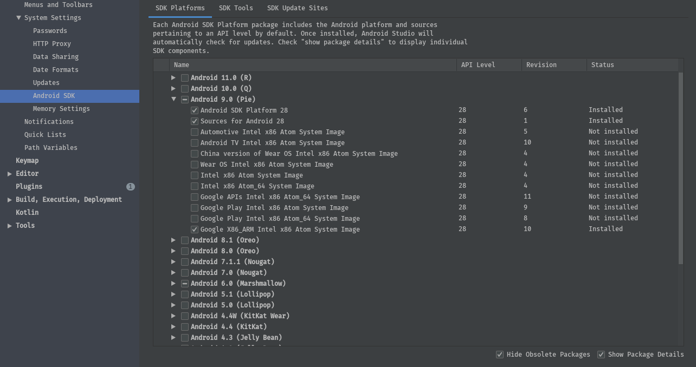

  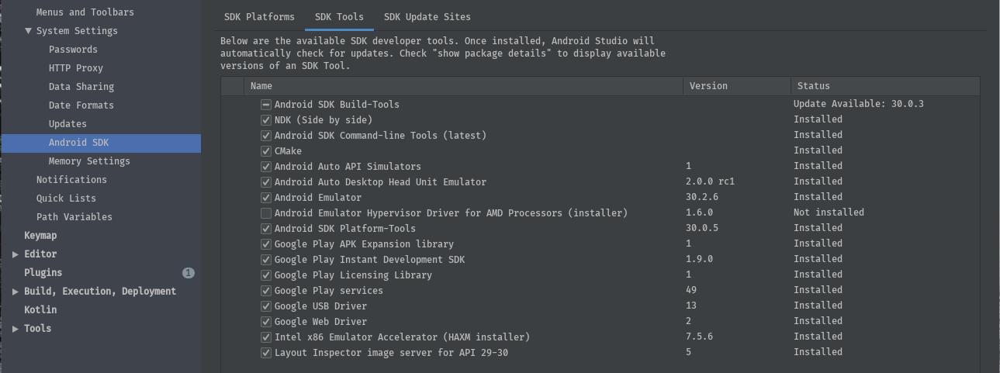

  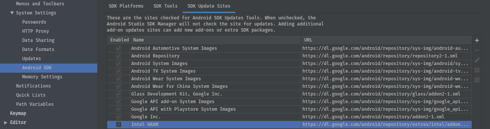

- Downloads for all these will be huge so please be patient
- Once you have all the dependencies in place, create a new AVD with **"Android Version 9.0 and above"** (not the production-builds i.e. "Google Play" System Images)
- I prefer to use **"Google X86_ARM Intel x86 Atom System Image"** because it has pre-build ABI's for **"x86"** as well as **"ARM"**
- The only drawback to this image is it doesn't have **"Google Play Store"**, so testers testing **"Google API's"** or **"Google Protect"** implementation will not have a good chance with this image  :disappointed:
- Android System Images with **"Google Play Store"** are production-builds (what I have understood after reading multiple blogs). You can get `adb` running as `root` only on development-builds. So, try to avoid Android System Images with **"Google Play Store"** as you won't be able to get the root easily
- Finally, AVD creation page will look like **(Just some settings which I prefer)**

  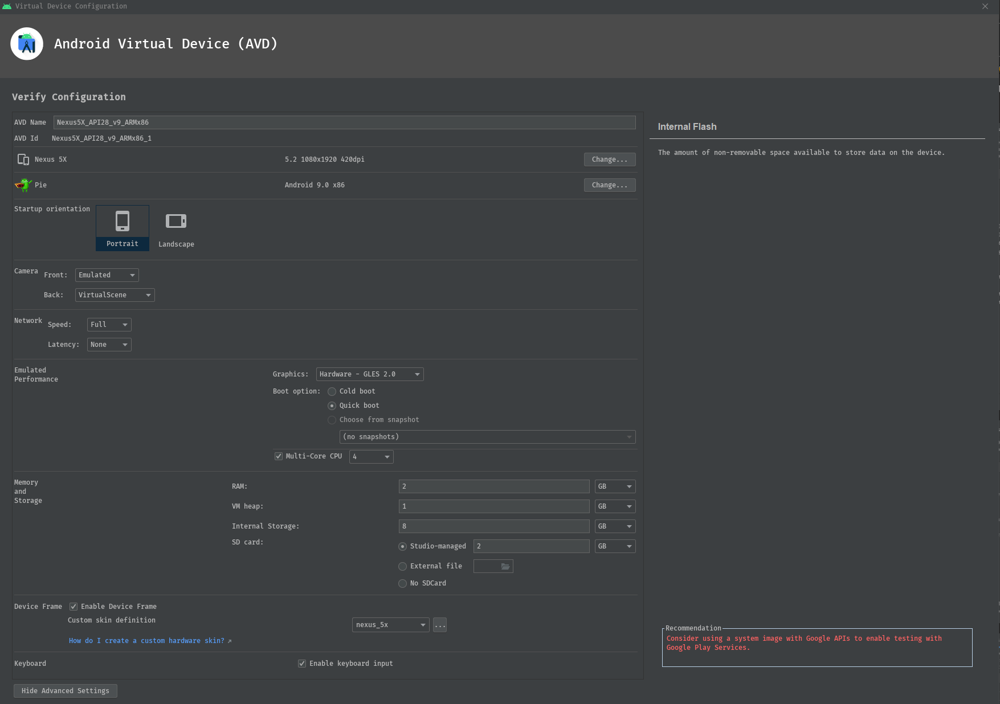

- Once, you are done with AVD creation, run it and let it expand it wings :wink:
- It will create encryption keys and other stuffs in **AVD_DATA_PATH**
- By default, this path is : `%USERPROFILE%\.android\avd`
- Here, you will find all the images related to **"RAM"** and **"Internal Storage"** with **"SDCard"**
- **"RASE"** also uses this to save **"snapshots"** of your Rooted AVD. So, if this not the path for you, then the RASE-script will ask you the path where AVD data is saved
- Once you have the AVD running, do setup the AVD and then close it
- One more very important thing is to add **"__ANDROID_PLATFORM_TOOLS__"** and **"ANDROID_EMULATOR"** from **"AndroidSDK"** folder to **"Environment Path Variables"** so that you can access commands like **"adb.exe"** and **"emulator.exe"** from anywhere
- Default Path for **"Android SDK"** : `%AppData%\Local\Android\Sdk`
- In this you will have 2 folders : `%AppData%\Local\Android\Sdk\platform-tools` and `%AppData%\Local\Android\Sdk\emulator`. Make sure that they are added to the `%PATH%` variable
- Logout and login back once you set the `%PATH%` variable to make it in effect
- Once you have completed all of above, we are good to run the script and root the AVD  :metal::metal::fire:

:point_up: <a href="#">Back to top</a> :point_up:

---

## **RootIT!!**

---

- Check whether `adb.exe` and `emulator.exe` are in `%PATH%`

  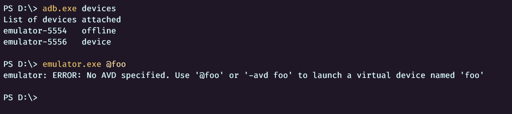

- Download or git clone the repository
- Open PowerShell and get inside the `git` folder you downloaded
- Run : `. .\Build-RootAVD.ps1` or `Import-Module .\Build-RootAVD.ps1` (TAB WORKS :wink:)
- First run : `Build-RootAVD`
- It will show the result as

  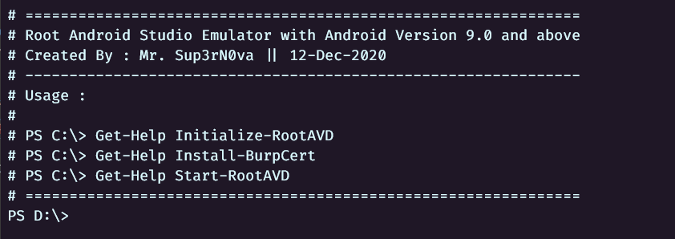

- Then : `Get-Help Initialize-RootAVD` - Always good to check `help` and `examples` of the module before running it

  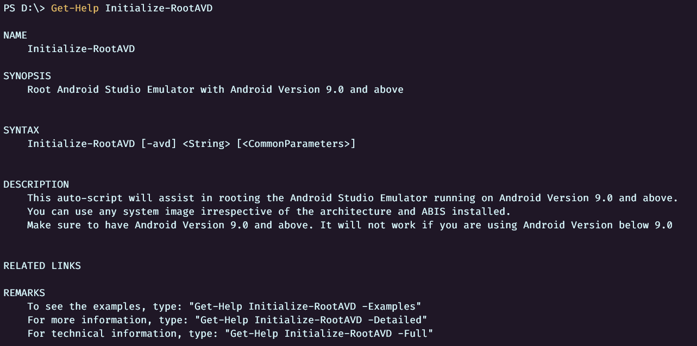

- Please check examples also

  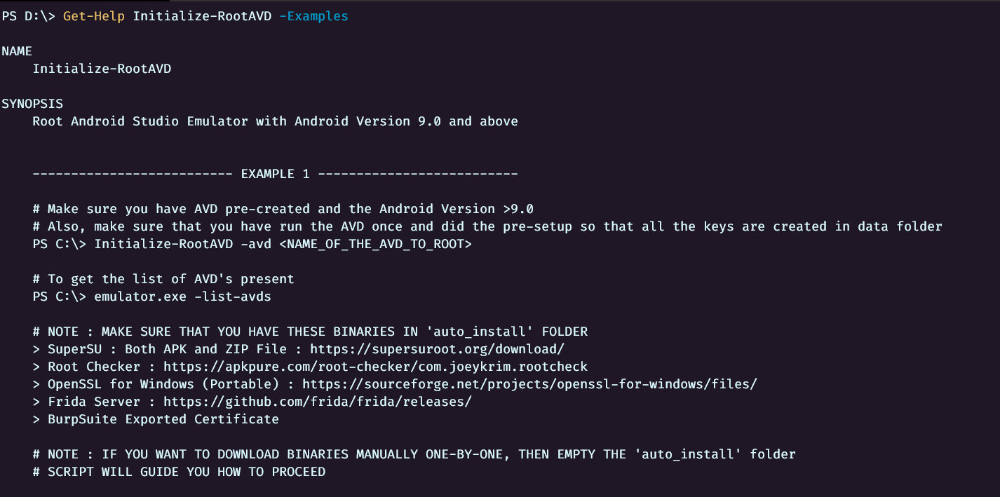

- Once you have read it through, use same steps to check other modules also. But let me paint it for you in brief here :
  - `Initialize-RootAVD` : Asks user the name of the AVD to root, then roots it, installs Burp cert provided by the user in the Root CA Store and creates a rooted snapshot for rebooting
  - `Install-BurpCert` : Asks user the name of the AVD and if user has regenerated the BurpCert, then this will install that certificate in the Root CA Store of AVD and updates the snapshot
  - `Start-RootAVD` : Just starts the Rooted AVD with or without `http-proxy` settings

- Let's root : `Initialize-RootAVD -avd <NAME_OF_THE_AVD>`. If you forgot then name of the AVD, you can try `emulator.exe -list-avds` and it will show you the name of the AVD

  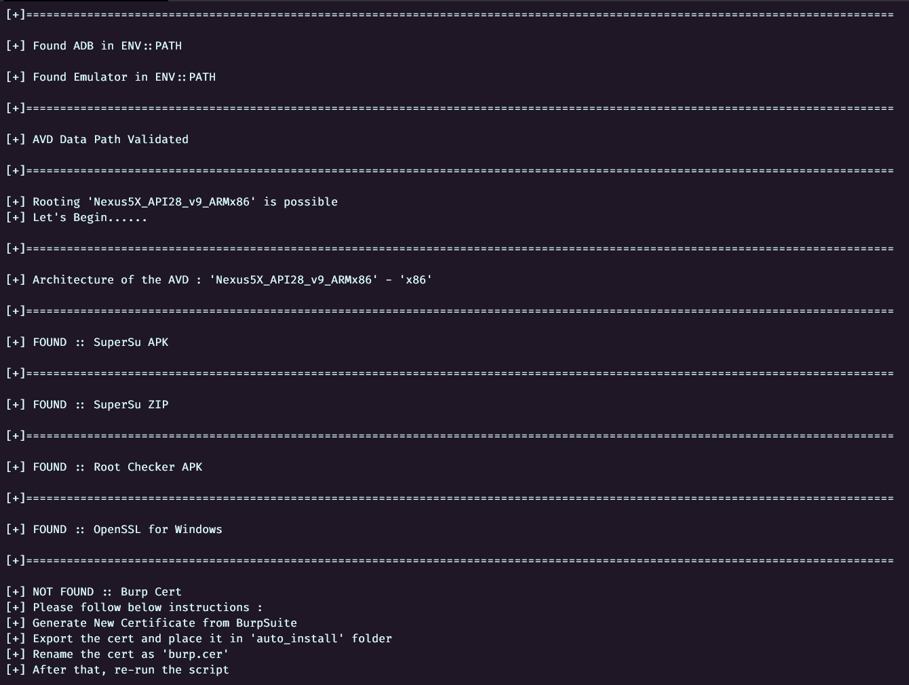

- You can see the error in the above screenshot as the script is not able to find `BurpCert` in `auto_install` folder. Please follow the instructions and you are good to go. Also, if you plan not to use the binaries attached, then empty the `auto_install` folder and the script will guide you with the steps
- Now we have `burp.cer` in `auto_install` folder, let's run the script again
- Run : `Initialize-RootAVD -avd <NAME_OF_THE_AVD>`

  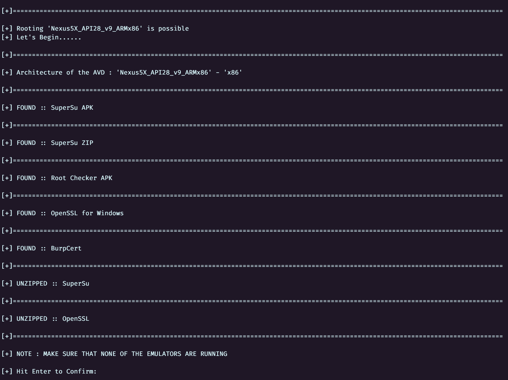

- As all the pre-checks are passed, we are ready to start the AVD and root it
- `Hit Enter` and :relieved::beers::beers:

  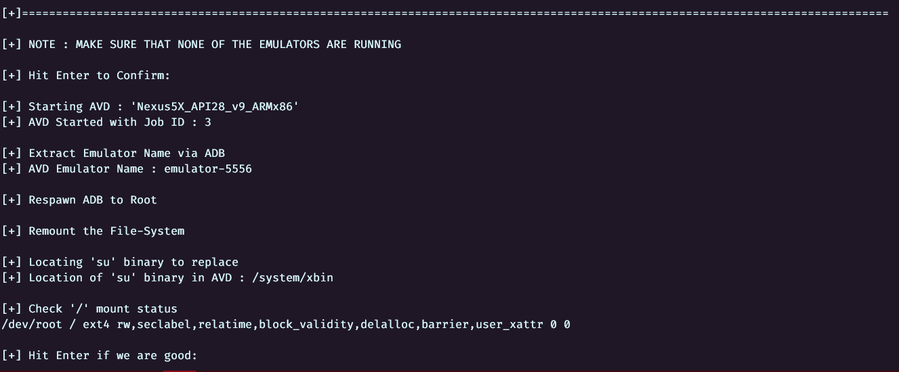

  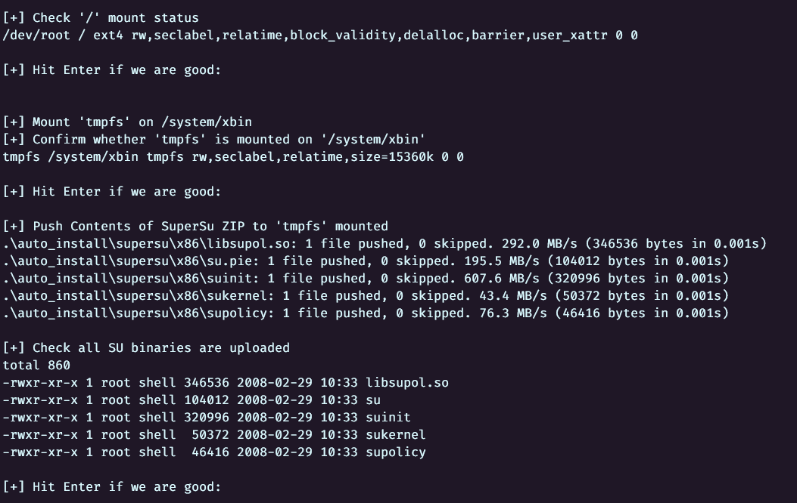

  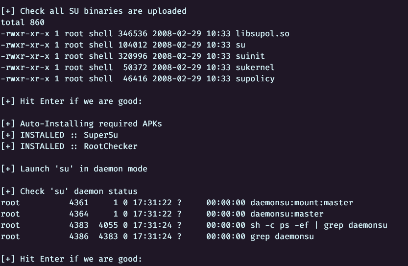

  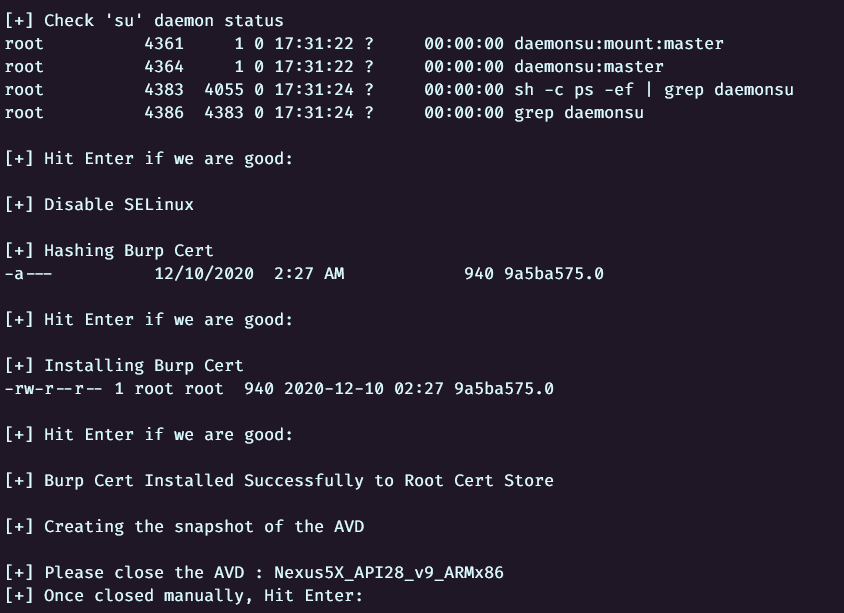

- Before closing the AVD, let's see whether we are able to root it or not

  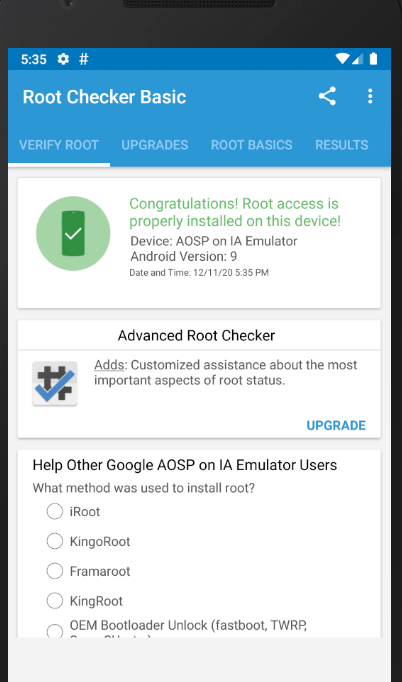

- Let's close this and restart it to check the persistance.

  > Make sure you use the script to restart the AVD else you will get an unrooted AVD

- Closing the AVD manually and hitting enter, it will do the clean-up and we are good to go
- Now, let's restart the AVD : `Start-RootAVD -avd <NAME_OF_THE_AVD>`

  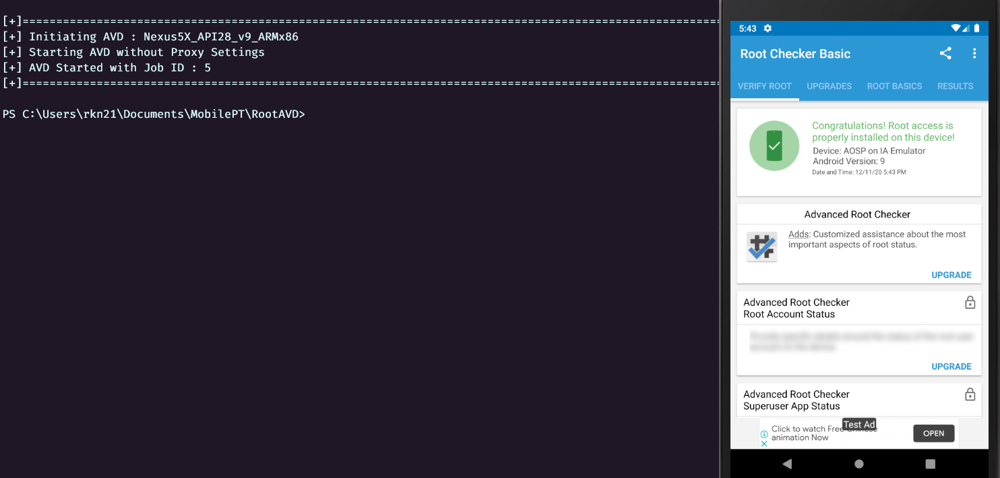

- If you want to set **'Android Studio HTTP Proxy'**, you can say : `Start-RootAVD -avd <NAME_OF_THE_AVD> -http_proxy <IP:PORT>`

- Similary for installing new cert and updating the snapshot : Run - `Get-Help Install-BurpCert` and `Get-Help Install-BurpCert -Examples`

  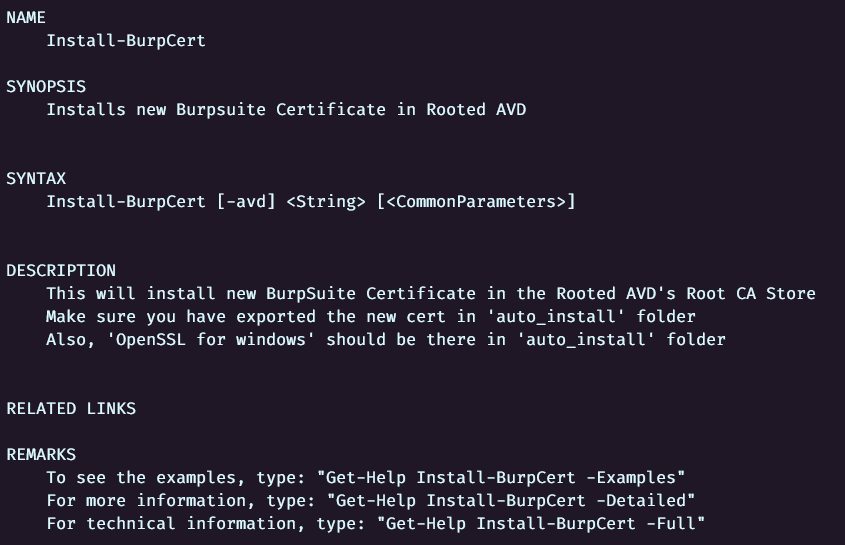

  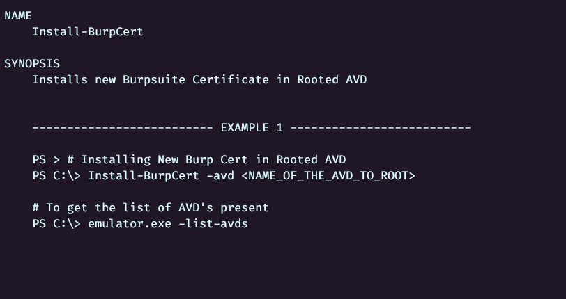

- Rest whole of the process is same as of `Initialize-RootAVD`

:point_up: <a href="#">Back to top</a> :point_up:

---

## **Points to Ponder**

---

> Wiping the data will delete the rooted snapshot created but you can re-root using the same above method

> After wiping make sure that you run the AVD once to set it up before rooting

> For best results use : `Nexus5` or `Nexus5X`

:point_up: <a href="#">Back to top</a> :point_up:

---

## **Some Errors**

---

- There are times, I have seen error like

  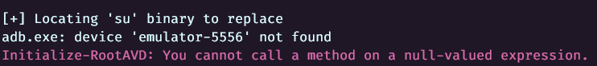

- This generally happens when your `adb` is not running. If this error comes, kill the `adb` server and restart it
- Run : `adb.exe kill-server` and `adb.exe start-server` and then check `adb.exe devices`
- If you are getting something like below then we are good to go

  
  
:point_up: <a href="#">Back to top</a> :point_up:

---

## **BIG SHOUT-OUT**

---

- A big shout-out to **"Tony Tannous"** for his article on rooting Android Emulator
- I have read multiple articles and blogs but this one was the best out of all
- This is all his work and I just automated the whole process

  > [**REFERENCE ARTICLE**](https://anthony-f-tannous.medium.com/android-10-emulation-of-magisk-supersu-on-an-aosp-avd-de93ed080fad)
  
- **"REQUEST YOU ALL TO VISIT THIS ONCE"**
